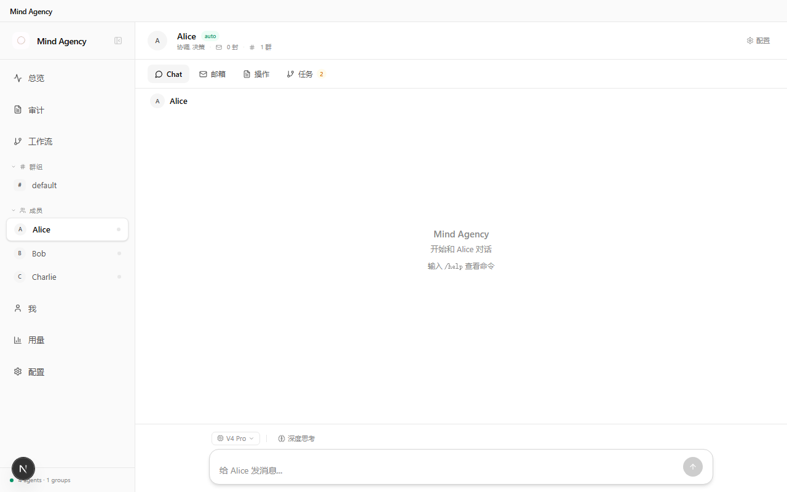
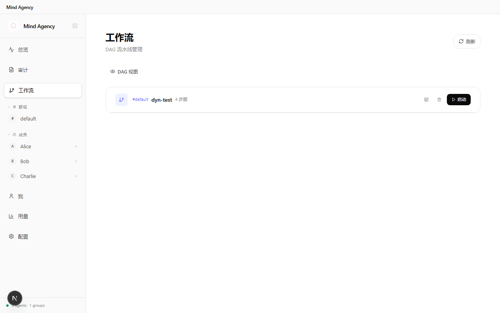

<div align="center">


# Mind Agency

### From Agent to Agency

一个 AI 做不了的事，一群 AI 可以。

[](LICENSE)
[](package.json)
[]()
[](https://github.com/Toufumind/mind-agency)

</div>

---

**Mind Agency** 让多个 AI 组成团队，像人类团队一样分工协作。

你用 AI 写代码、跑部署、做决策——但只有一个 AI 在干活。没人 review，没人 test，没人发现问题。直到出了事。

Mind Agency 给你一个 AI 团队：Alice 写代码，Bob 审查，Charlie 测试。有分歧？投票决定。需要你批准？自动暂停等你。

<div align="center">

<br/>
<em>仪表盘 — Agent 状态、群组、消耗一览</em>
</div>

---

## 它能做什么

### 👥 团队协作，不是一个人单干

每个 Agent 有自己的角色和专长。Alice 专注写代码，Bob 负责审查，Charlie 做测试。它们通过群聊和邮件协作，就像真正的团队。

```
你: @Alice 帮我写一个用户注册接口
Alice: 好的，我来写
Alice: @Bob 代码写好了，帮我 review 一下
Bob: 看了一下，有两个问题：1. 缺少输入校验 2. 密码没有加密
Alice: 改好了，你再看看
Bob: ✅ 没问题了
Alice: @Charlie 帮我跑一下测试
Charlie: 测试全部通过 ✅
```

<div align="center">

<br/>
<em>Agent 详情 — Chat / 邮箱 / 操作 / 任务</em>
</div>

### 🔄 流水线自动化

定义好流程：谁写、谁审、谁测、谁部署。Agent 按步骤自动流转。

```
Alice 写代码 → Bob 审查 → Charlie 测试 → [等你批准] → 部署
```

需要你批准的步骤会自动暂停，等你点"批准"。进程崩溃了？重启后自动从上次断点继续。

<div align="center">

<br/>
<em>工作流 — DAG 流水线，一键启动</em>
</div>

### 🧠 团队经验越积累越多

Agent 记住团队的每一次协作。上次部署出了什么问题、哪个测试总失败、做了什么技术决策——新成员来了也能快速上手。

### 📋 每一步都有记录

每个 Agent 的每个动作都被记录。出了问题？回溯日志找到根因。不会静默丢数据，不会出了问题找不到原因。

---

## 快速开始

### 下载安装（推荐）

从 [Releases](https://github.com/Toufumind/mind-agency/releases) 下载 `Mind-Agency-Setup-0.3.0.exe`，双击运行。

> ⚠️ 当前仅支持 Windows。macOS / Linux 支持在路线图中。

### 从源码运行

```bash
git clone https://github.com/Toufumind/mind-agency.git
cd mind-agency
npm install
npm run dev
```

打开 `http://localhost:3000`，首次访问会引导你配置 API Key。

### 需要什么

- 一个 AI 模型的 API Key（[Claude](https://console.anthropic.com/) / [DeepSeek](https://platform.deepseek.com/) / [GPT-4o](https://platform.openai.com/)）
- DeepSeek 价格最低，几毛钱一天

---

## 和同类产品有什么不同

| | Mind Agency | CrewAI / AutoGen | 直接用 ChatGPT |
|---|:---:|:---:|:---:|
| 多个 AI 协作 | ✅ | ✅ | ❌ |
| 可视化界面 | ✅ | ❌ | ❌ |
| 人工审批节点 | ✅ | ❌ | ❌ |
| 崩溃自动恢复 | ✅ | ❌ | ❌ |
| 审计日志 | ✅ | ❌ | ❌ |
| 本地运行，数据在你手里 | ✅ | ✅ | ❌ |
| 一键安装 exe | ✅ | ❌ | N/A |

---

## 技术架构

```
Mind Agency (Electron 桌面应用)
├── 前端 — Next.js + Tailwind CSS (:3000)
│   Dashboard / Agent 管理 / 群组 / 工作流 / 设置
├── 后端 — Node.js WebSocket (:3001)
│   EventBus / WorkflowEngine / Scheduler
├── AI 层 — Claude Agent SDK
│   MCP 工具服务器 (群组/通信/工作流/记忆/共识/审计)
└── 数据 — 本地文件系统
    Agents/  Groups/  .audit/
```

---

## 项目结构

```
mind-agency/
├── src/
│   ├── app/              # Next.js 页面 + API 路由
│   ├── components/       # React 组件
│   └── lib/              # 核心库 (协作/工作流/记忆/共识/权限)
├── mcp/                  # MCP 工具服务器
│   ├── group-server.ts   # JSON-RPC 入口
│   └── tools/            # 模块化工具 (群组/通信/工作流/记忆...)
├── electron/             # Electron 主进程
├── server.ts             # WebSocket + EventBus (:3001)
├── Agents/               # 默认 Agent: Alice, Bob, Charlie
├── Groups/               # 默认群组 + 工作流
└── public/               # 静态资源
```

---

## 环境变量

| 变量 | 默认值 | 说明 |
|------|--------|------|
| `WS_PORT` | 3001 | WebSocket 端口 |
| `POLL_INTERVAL` | 30000 | Agent 轮询间隔 (ms) |
| `DAG_INTERVAL` | 5000 | 工作流检查间隔 (ms) |

详见 `.env.example`。

---

## License

[Apache License 2.0](LICENSE) — Copyright 2025 Toufumind
