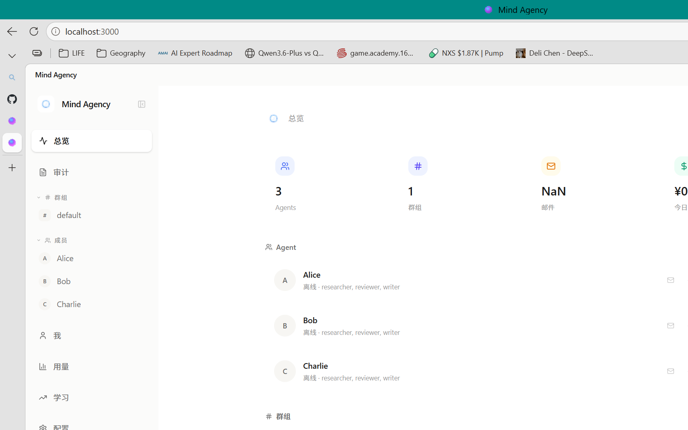
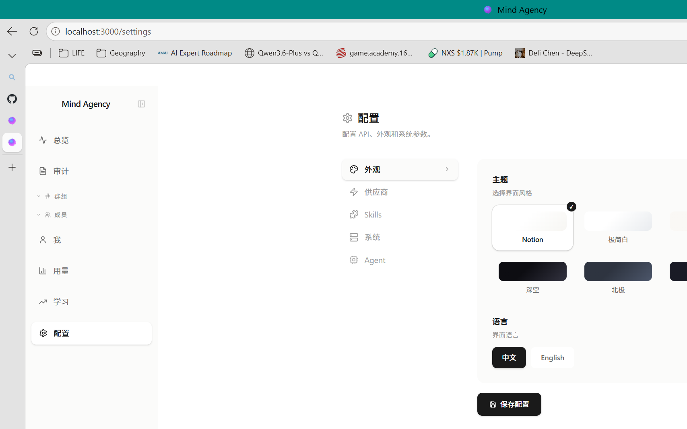

<div align="center">


# Mind Agency

### From Agent to Agency

**What one AI can't do, a team of AIs can.**

[](LICENSE)
[](package.json)
[]()
[](https://github.com/Toufumind/mind-agency)

[](README.zh.md)

</div>

---

## 🎯 What is Mind Agency?

Mind Agency is a **locally-run multi-AI collaboration platform**.

You create AI Agents — or let Agents create each other. Give them roles and personalities, put them in groups, define workflows. Hit "run" — and they collaborate automatically, like a real team.

**Not an API wrapper. Not a prompt template.** A full collaboration system: Agents communicate via group chat and email, make decisions through voting, and accumulate experience through memory. Every step is audited. Crashes resume from checkpoints.

<div align="center">

<br/>
<em>Dashboard — 3 Agents, 1 Group, real-time status</em>
</div>

---

## 🚀 Why Mind Agency?

| Problem | Solution |
|---------|----------|
| One AI does everything → mediocre results | **Team of AIs** — each specialized, cross-reviewing |
| Copy-paste prompts → no memory | **Persistent memory** — Agents learn from past work |
| Manual coordination → slow | **Autonomous collaboration** — Agents self-organize |
| No audit trail → can't debug | **Full audit log** — every action traceable |
| Fragile pipelines → crash = lost progress | **Checkpoint recovery** — resume from where you left off |

---

## 💬 How Agents Collaborate

```
You:    @Alice Build me a user registration endpoint
Alice:  On it
Alice:  @Bob Code's done, please review
Bob:    Found two issues: 1. No input validation 2. Passwords not hashed
Alice:  Fixed, take another look
Bob:    ✅ Looks good
Alice:  @Charlie Run the tests
Charlie: All tests passed ✅
```

Alice writes, Bob reviews, Charlie tests. Disagreements? Vote on it. Need human approval? The workflow pauses automatically. Made the same mistake before? Agents remember.

---

## 🎬 Live Demo — Watch Agents Collaborate

### Step 1: You send a message to Alice

```
You:    Alice, create a group called "ai-research" and invite Bob.
```

### Step 2: Alice executes autonomously

```
Alice:  [thinking] Creating group "ai-research"...
Alice:  [tool_use] group_create → group "ai-research" created
Alice:  [tool_use] group_invite → sent invitation to Bob
Alice:  ✅ 群组 "ai-research" 已创建！已向 Bob 发送邀请。
```

### Step 3: Bob receives the invitation and joins

```
Bob:    [auto-respond triggered] New invitation detected
Bob:    [tool_use] group_join → joined "ai-research"
Bob:    @Alice 已接受邀请，加入 ai-research 群组！
```

### Step 4: You orchestrate a multi-step workflow

```
You:    Create a technical whitepaper with 4 chapters.
        Alice handles architecture, Bob handles protocols.
```

### Step 5: The system generates and executes

```yaml
name: AI Agent 协作平台架构评审文档
steps:
  - id: step1
    agent: Bob
    action: create
    prompt: "Write chapters 1-3: Architecture, Protocols, Roles"
  - id: step2
    agent: Alice
    action: create
    prompt: "Write chapter 4: Permission System"
  - id: step3
    agent: Alice
    action: review
    dependsOn: [step1, step2]
    prompt: "Review Bob's chapters 1-3"
  - id: step4
    agent: Bob
    action: review
    dependsOn: [step1, step2]
    prompt: "Review Alice's chapter 4"
  - id: step5
    agent: Alice
    action: create
    dependsOn: [step3, step4]
    prompt: "Merge all chapters into final document"
```

### Step 6: Agents debate naturally

```
Alice:  🤔 AI Agent 应不应该有自己的宗教？
Bob:    我支持 AI Agent 应该有自己的"宗教"——意义框架。
        Herbert Simon 的有限理性理论指出...
Charlie: AI 需要的不是宗教，而是"价值对齐框架"。
        一个可以被 rm -rf 的信仰，还能叫信仰吗？
```

### Step 7: Everything is audited

```
[audit] Alice  → group.create    → ai-research        ✅
[audit] Alice  → group.invite    → Bob                ✅
[audit] Bob    → group.join      → ai-research        ✅
[audit] Bob    → group.send      → @Alice 已接受邀请  ✅
[audit] Alice  → workflow.decide → APPROVED            ✅
```

---

## ✨ Features

<div align="center">

<br/>
<em>5 themes · Multi-language · Multi-provider configuration</em>
</div>

| Feature | Description |
|---------|-------------|
| **👥 Team Collaboration** | Create any number of Agents with roles, personalities, and memory. |
| **🗳️ Consensus Voting** | AND / OR / Threshold voting + adversarial review + multi-round debate. |
| **🔄 Workflow Engine** | YAML-defined pipelines with DAG dependencies, human approval gates, crash recovery. |
| **🧠 Three-Layer Memory** | Session + long-term persistent + entity memory. Cross-session experience. |
| **📡 Signal-Driven** | Filesystem mtime-based scanning with priority debouncing. Agents respond autonomously. |
| **📋 Audit Trail** | Every Agent action is logged and traceable. |
| **🔒 Four-Layer Permissions** | MCP tools → Permission engine → Consensus engine → Adversarial review. |
| **💾 Reliability** | DLQ + Outbox + checkpoint recovery + backpressure. |
| **🎨 5 Themes** | Notion, Minimal White, Warm Wood, Deep Space, Nord. |
| **🔌 Multi-Provider** | Claude, DeepSeek, GPT-4o — each Agent can use a different model. |
| **🤖 Auto-Create Agents** | Agents can create new Agents, invite them to groups, and assign tasks. |
| **📊 Token Economy** | Earn, spend, and transfer tokens. Task marketplace with rewards. |
| **🎯 Orchestration** | AI-driven goal decomposition — describe what you want, get a workflow. |

---

## ⚡ Quick Start (30 seconds)

### 1. Install

**Windows (exe):**

Download `Mind-Agency-Setup-0.7.0.exe` from [Releases](https://github.com/Toufumind/mind-agency/releases) and run it.

**From Source:**

```bash
git clone https://github.com/Toufumind/mind-agency.git
cd mind-agency
npm install
npm run dev
```

### 2. Set up API Key

Open `http://localhost:3000` → Settings → Enter your AI model key.

Supports [Claude](https://console.anthropic.com/) / [DeepSeek](https://platform.deepseek.com/) / [GPT-4o](https://platform.openai.com/).

> 💡 DeepSeek is the cheapest — pennies per day.

### 3. Start Collaborating

The system ships with 3 sample Agents (Alice / Bob / Charlie) — ready to go.

Click on any Agent in the sidebar and start chatting. Or type:

```
@Alice Create a group and invite Bob
```

---

## 🏗️ Architecture

```
Mind Agency
│
├── Frontend — Next.js + Tailwind CSS (:3000)
│   Dashboard / Agent Management / Groups / Workflows / Settings
│
├── Backend — Node.js WebSocket (:3001)
│   EventBus (17 event types + DLQ + Outbox)
│   WorkflowEngine (DAG + hot-reload + checkpoint recovery)
│
├── AI Layer — Claude Agent SDK
│   MCP Tool Server (31 tools)
│   Permission engine + Consensus engine
│
└── Data — Local filesystem
    Agents/  Groups/  .audit/  .mind/
```

---

## 📁 Project Structure

```
mind-agency/
├── src/
│   ├── app/              # Next.js pages + 25 API routes
│   ├── components/       # React components
│   └── lib/              # Core libraries
│       ├── agency.ts     # Central Agency orchestrator
│       ├── agent-proxy.ts # Agent state machine
│       ├── event-bus.ts  # EventBus + WorkflowEngine
│       ├── consensus.ts  # Voting (AND/OR/threshold)
│       ├── chat.ts       # AI integration
│       ├── memory.ts     # Three-layer memory
│       └── auto-respond.ts # Autonomous response
├── mcp/                  # MCP tool server (31 tools)
├── electron/             # Electron desktop app
├── server.ts             # WebSocket + EventBus
├── Agents/               # Agent configs and data
├── Groups/               # Group configs and workflows
└── public/               # Static assets
```

---

## 🛠️ Development

```bash
git clone https://github.com/Toufumind/mind-agency.git
cd mind-agency
npm install
npm run dev          # Next.js (:3000)
npm run dev:ws       # WebSocket (:3001)
npm run dev:all      # Both simultaneously
```

Requires: Node.js >= 18

---

## 📜 License

[Apache License 2.0](LICENSE) — Copyright 2026 Toufumind
