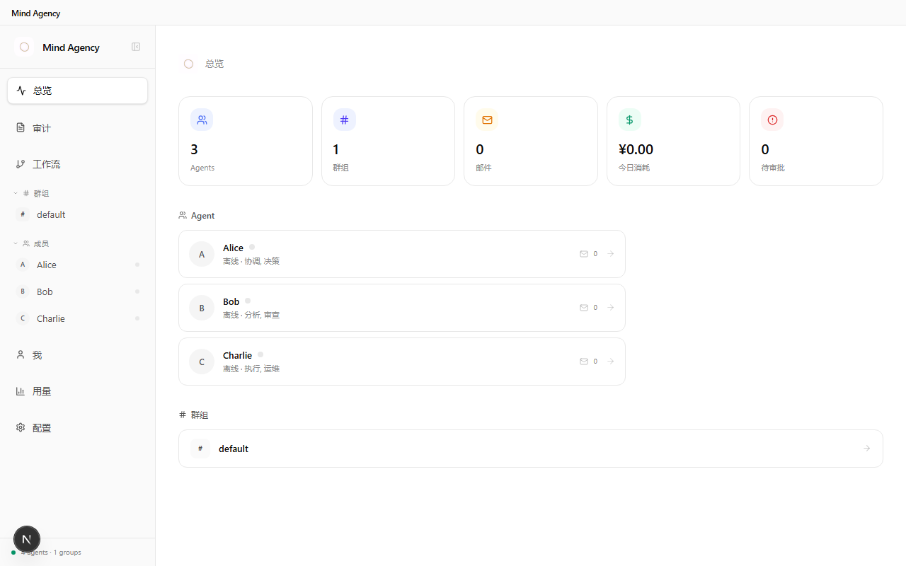

<div align="center">


# Mind Agency

### From Agent to Agency

**一个 AI 做不了的事，一群 AI 可以。**

[](LICENSE)
[](package.json)
[]()
[](https://github.com/Toufumind/mind-agency)
[](https://mindagency.cn)

</div>

---

## Mind Agency 是什么

Mind Agency 是一个本地运行的多 AI 协作平台。

你创建 Agent，或者让 Agent 自己创建 Agent。给它们角色和性格，拉进群组，定义工作流。然后点"运行"——Agent 们自动分工、协作，像一个真正的团队在工作。

**不是 API wrapper，不是 prompt template。** 是一个完整的协作系统：Agent 之间通过群聊和邮件通信，通过投票做决策，通过记忆积累经验。每一步都有审计日志，崩溃了可从断点恢复。

<div align="center">

</div>

---

## 为什么叫 Mind Agency

**Agent** — 一个 AI 助手，一个独立的个体。

**Agency** — 一个机构，一个有组织的团队。

从 Agent 到 Agency，就是从"一个 AI 干所有事"到"一群 AI 分工协作"。一个人能写代码，但一个人写不出好代码。AI 也一样。

---

## 协作示例

```
你:    @Alice 帮我写一个用户注册接口
Alice: 好的，我来写
Alice: @Bob 代码写好了，帮我 review 一下
Bob:   看了一下，有两个问题：1. 缺少输入校验 2. 密码没有加密
Alice: 改好了，你再看看
Bob:   ✅ 没问题了
Alice: @Charlie 帮我跑一下测试
Charlie: 测试全部通过 ✅
```

Alice 写代码，Bob 审查，Charlie 测试。有分歧？投票决定。需要你批准？自动暂停等你。上次踩过什么坑？Agent 记得，下次不会再犯。

---

## 功能特性

| 功能 | 说明 |
|------|------|
| **👥 团队协作** | 创建任意数量的 Agent，各有角色、性格、记忆。通过群聊和邮件协作。 |
| **🗳️ 共识投票** | AND / OR / 阈值三种投票模式 + 对抗性审查 + 多轮辩论。 |
| **🔄 工作流引擎** | YAML 定义流水线，条件分支、人工审批、崩溃恢复、热重载。 |
| **🧠 三层记忆** | 短期会话 + 长期持久 + 项目实体。跨会话经验积累。 |
| **📡 信号驱动** | 基于文件系统 mtime 的增量扫描，优先级防抖，Agent 自主响应。 |
| **📋 审计日志** | 每个 Agent 的每个动作都有记录，可追溯。 |
| **🔒 四层权限** | MCP 工具 → 权限引擎 → 共识引擎 → 对抗性审查。 |
| **💾 可靠性** | DLQ + Outbox + 断点恢复 + Backpressure。 |
| **🎨 多主题** | Notion、极简白、暖木、深空、北极。 |
| **🔌 多供应商** | Claude、DeepSeek、GPT-4o，每个 Agent 可以用不同模型。 |

---

## 快速安装

### Windows

从 [Releases](https://github.com/Toufumind/mind-agency/releases) 下载 `Mind-Agency-Setup-0.4.0.exe`，双击安装。

### 从源码

```bash
git clone https://github.com/Toufumind/mind-agency.git
cd mind-agency
npm install
npm run dev
```

> ⚠️ exe 目前仅支持 Windows。macOS / Linux 请从源码运行。跨平台支持在路线图中。

---

## 5 分钟上手

**1. 配置 API Key**

打开 `http://localhost:3000`，进入设置页面，填入你的 AI 模型 Key。

支持 [Claude](https://console.anthropic.com/) / [DeepSeek](https://platform.deepseek.com/) / [GPT-4o](https://platform.openai.com/)。DeepSeek 价格最低，几毛钱一天。

**2. 创建 Agent**

系统自带示例 Agent（Alice / Bob / Charlie / 你），开箱即用。你也可以自己创建，或者让 Agent 通过 `agent_create` 工具自己招募新成员：

```
名字: Diana
角色: 前端专家
性格: 严谨，注重代码质量，喜欢用 React
```

每个 Agent 有独立的配置、记忆和行为画像。

**3. 建立群组**

把 Agent 拉进群组。群组有自己的聊天频道、邮件系统和工作流。

**4. 开始协作**

给 Agent 分配任务，看它们自动协作。或者定义工作流，让流水线自动跑：

```yaml
steps:
  - id: write
    agent: Alice
    action: code
    prompt: 写一个用户注册接口
  - id: review
    agent: Bob
    action: review
    dependsOn: [write]
  - id: test
    agent: Charlie
    action: test
    dependsOn: [review]
  - id: approve
    action: human_approval
    dependsOn: [test]
```

---

## 技术架构

```
Mind Agency (Electron 桌面应用)
│
├── 前端 — Next.js + Tailwind CSS (:3000)
│   Dashboard / Agent 管理 / 群组 / 工作流 / 设置
│
├── 后端 — Node.js WebSocket (:3001)
│   EventBus (17 事件类型 + DLQ + Outbox)
│   WorkflowEngine (DAG + 热重载 + 断点恢复)
│
├── AI 层 — Claude Agent SDK
│   MCP 工具服务器 (31 个工具)
│   权限引擎 + 共识引擎
│
└── 数据 — 本地文件系统
    Agents/  Groups/  .audit/  .mind/
```

---

## 项目结构

```
mind-agency/
├── src/
│   ├── app/              # Next.js 页面 + 25 个 API 路由
│   ├── components/       # React 组件
│   └── lib/              # 核心库
│       ├── event-bus.ts  # EventBus + WorkflowEngine
│       ├── consensus.ts  # 共识引擎 (AND/OR/阈值 + 对抗性审查)
│       ├── chat.ts       # AI 集成 (Claude/DeepSeek/Codex)
│       ├── memory.ts     # 三层记忆系统
│       ├── auto-respond.ts # 信号驱动自主响应
│       └── ...
├── mcp/                  # MCP 工具服务器
├── electron/             # Electron 主进程
├── server.ts             # WebSocket + EventBus + Workflow
├── Agents/               # Agent 配置和数据
├── Groups/               # 群组配置和工作流
└── public/               # 静态资源
```

---

## 开发

```bash
git clone https://github.com/Toufumind/mind-agency.git
cd mind-agency
npm install
npm run dev          # Next.js (:3000)
npm run dev:ws       # WebSocket (:3001)
npm run dev:all      # 同时启动
```

环境要求：Node.js >= 18

---

## License

[Apache License 2.0](LICENSE) — Copyright 2026 Toufumind
